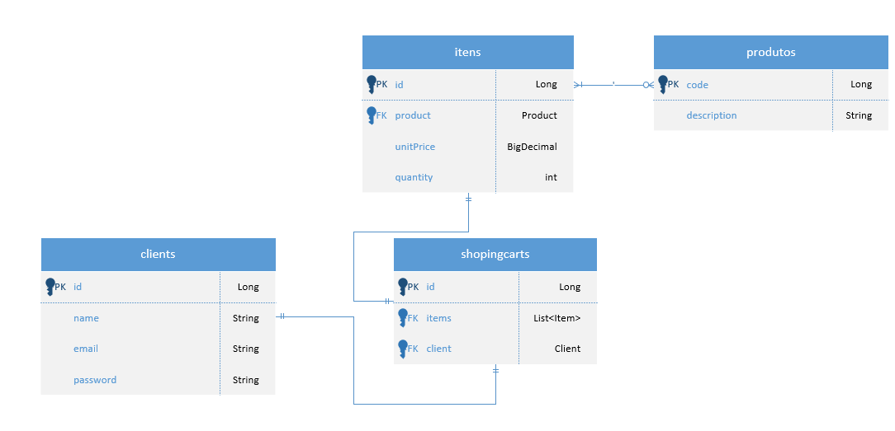
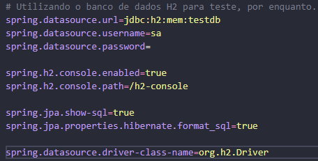
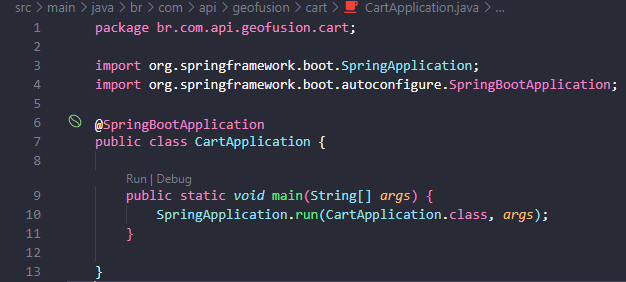

# ShoppingCart System Api

## Descrição Geral

Projeto feito com o intuito de realizar o desafio técnico da empresa [GEOFUSION](https://www.geofusion.com.br/) para o cargo de **Desenvolvedor back-end júnior**.

### Descrição do projeto:

Projeto consiste em criar uma api para um carrinho de compras. Onde obrigatóriamente tem as funcionalidades mínimas de:

    * Cadastro de produtos.
    * Alteração de preços.
    * Criação de carrinhos.

Segue modelo entidade relacionamento do projeto:



Ao analisarmos o *mer* acima vemos que para a criação de um carrinho precisamos de um cliente que será passado como parâmetro onde um cliente poderá ter apenas um carrinho e um carrinho pertencerá apenas a um cliente.

O cadastro de produtos e registro de clientes são feitos independentemente de outras tabelas.

Para criarmos um item teremos que ter obrigatóriamente um produto já cadastrado, onde este produto poderá pertencer a outros itens de outros carrinhos diferentes.

**Observação**: Por via de testes e melhora da aplicação **REST**, foram feitos mais *end-points* do que foram pedidos.

### EndPoints do projeto:

EndPoints principais do projeto.

#### Para Client:
registro: /client/register [Post] Abaixo segue *request body*:
``` Json Body
{
    "name": "string",
    "email": "string",
    "password": "string"
}
```

listar: /client [Get]

#### Para Produtos:
- Cadastro: /product/register [Post] Abaixo segue *request body*:
``` Json Body
{
    "description": "string",
}
```
- Listar: /product [Get]

#### Para Item:
- Update **Ateração de preços**: /item/update/{itemId} passar **id** do item na url 

[Put] Abaixo segue request:
``` Json Body
{
    "unitPrice": "BigDecimal"
}
```
- Listar: /item [Get]

#### Para Carrinho:
- Criar carrinho: /shopping-cart/register/{clientId} passar **id** do client na url [Post]

- Listar: /shopping-cart/client-cart/{clientId} [Get]

- Adicionar itens: /shopping-cart/add-item?clientId=id&productId=id passar os ids respectivos do cliente e do produto como *query params*.

[Put] Abaixo segue request:
``` Json Body
{
    "unitPrice": "BigDecimal",
    "quantity": "int"
}
```

- Deletar item passando o produto como parametro: /shopping-cart/delete-product/cart?clientId=id&productId=id [Delete]

- Deletar item passando a posição: /shopping-cart/delete-product/cart?clientId=id&indexItem=posição [Delete]

### Descrição - Executar Api localmente:
- Para clonar o projeto: git clone https://github.com/TaylanTorres09/desafio-geofusion-carrinho-compras.git
- Para Executar o projeto precisasse:
    - Java [JDK](https://www.oracle.com/java/technologies/downloads/#java17). Este projeto está usando a versão 17.
    - Banco [H2](https://www.h2database.com/html/main.html) utilizado em memória, coloquei no perfil de teste pois podemos abranger para outro banco de dados quando a api for colocada em produção.

- Extensões do vscode utilizadas:
    - [Debugger for Java](https://marketplace.visualstudio.com/items?itemName=redhat.java)
    - [Spring Boot Extension Pack](https://marketplace.visualstudio.com/items?itemName=Pivotal.vscode-boot-dev-pack)

- Configuração do banco de dados.



- Na pasta src/main, execute o arquivo CartApplication.java



- Para testar a api você pode utilizar ferramentas de client como:
    - [Postman](https://www.postman.com/)
    - [Insomnia](https://insomnia.rest/download)
    - Extensão do VsCode [Thunder Client](https://marketplace.visualstudio.com/items?itemName=rangav.vscode-thunder-client)
    - Ou outra de sua preferência.

### Próximos Passos
- Criar sessão por usuário.
- Fazer interfaces no front-end.

## Autor
<a href="https://www.linkedin.com/in/taylan-torres" target="_blank"></a> 